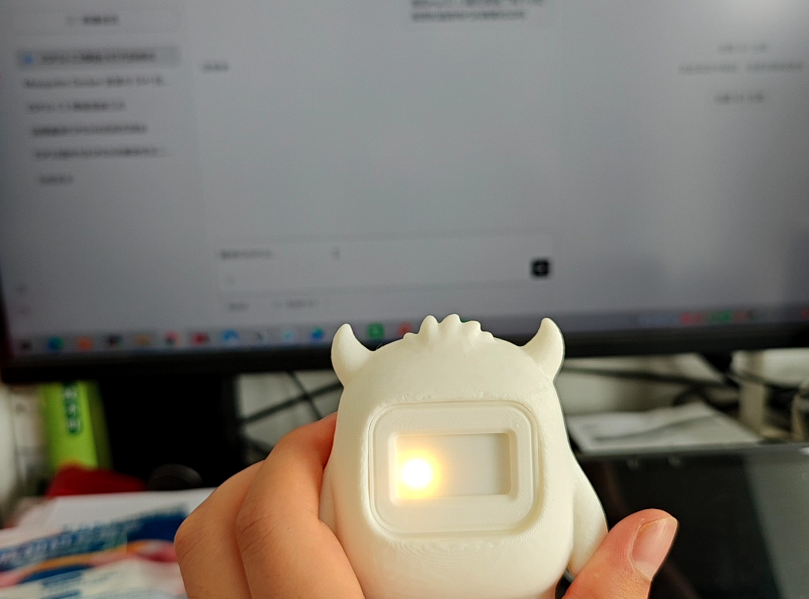
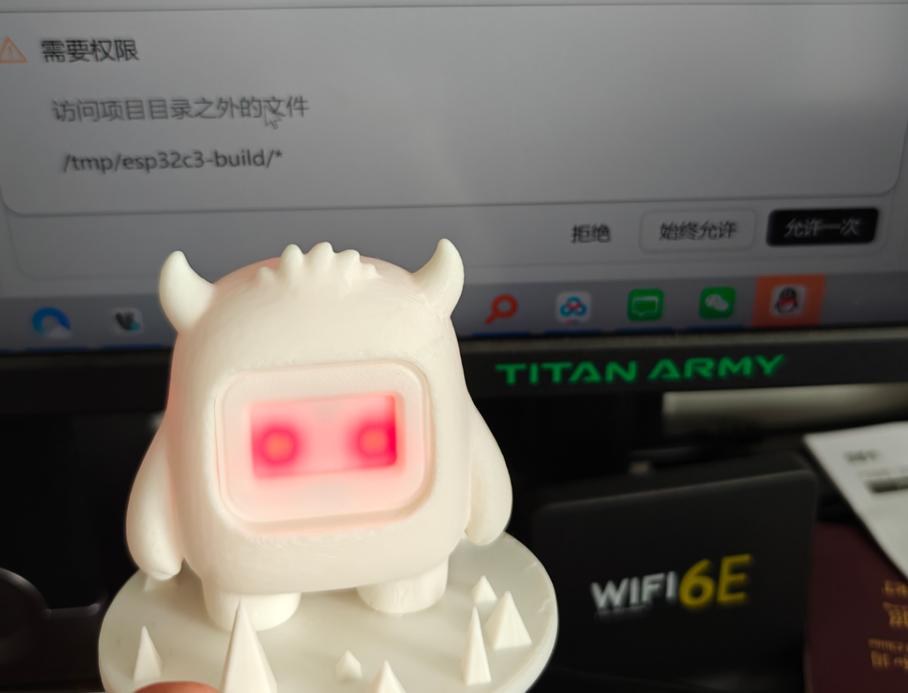
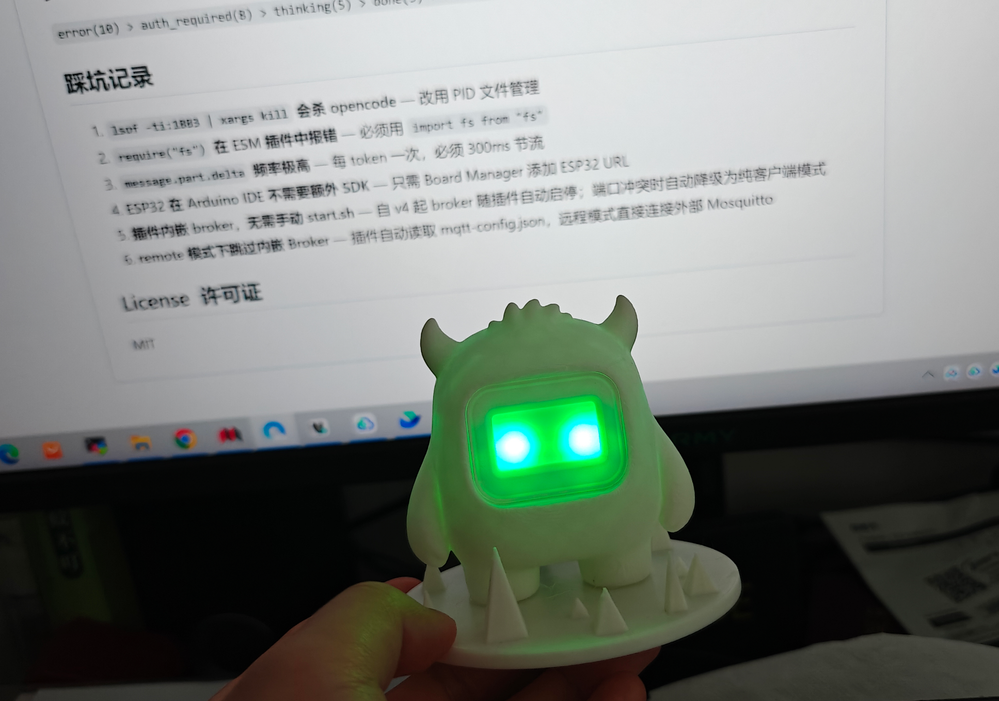
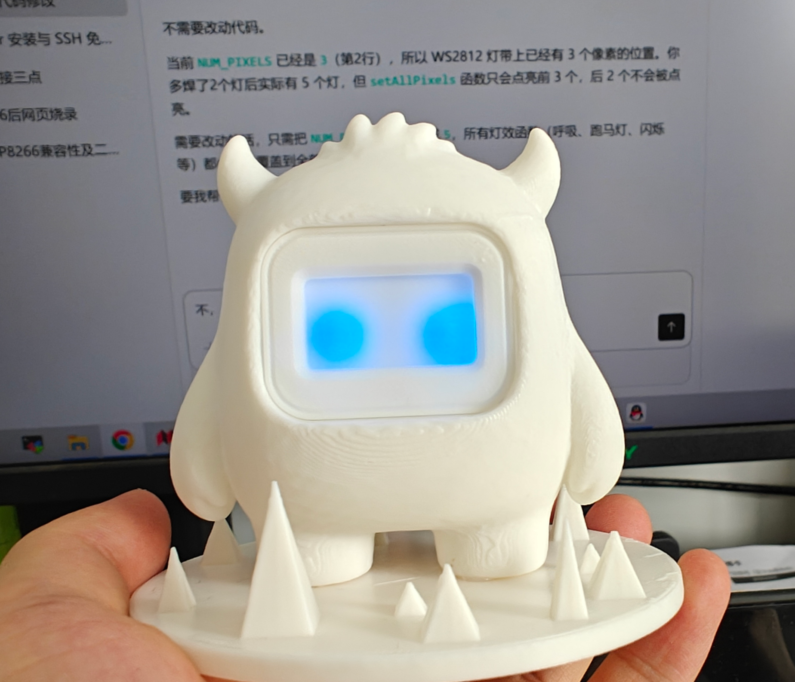
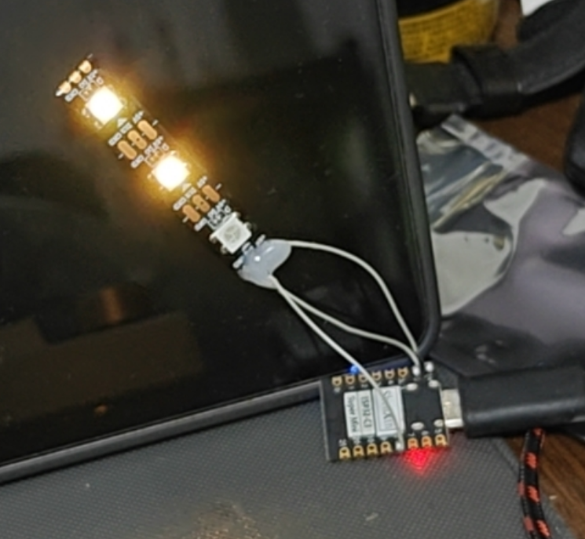
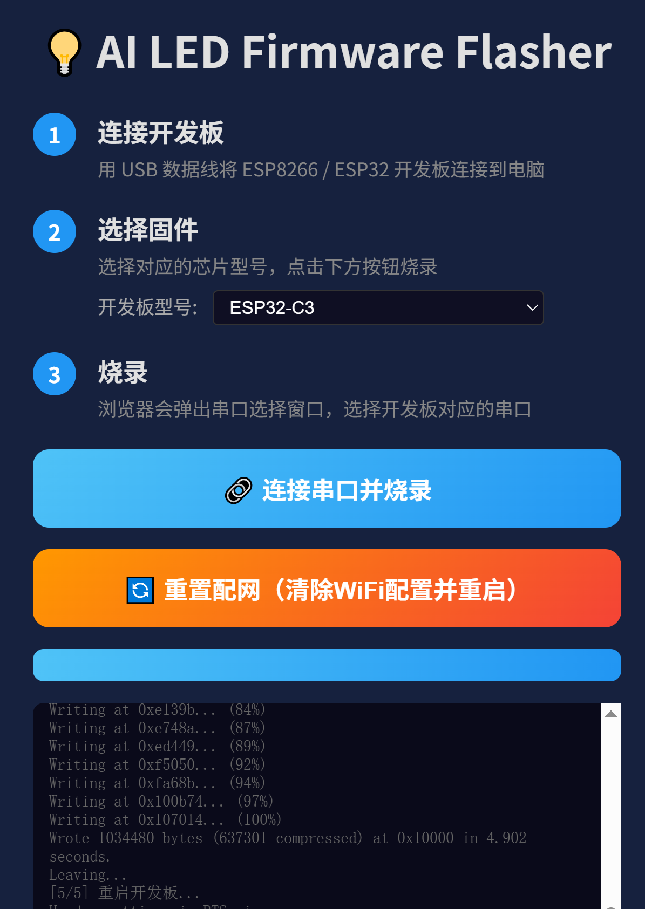
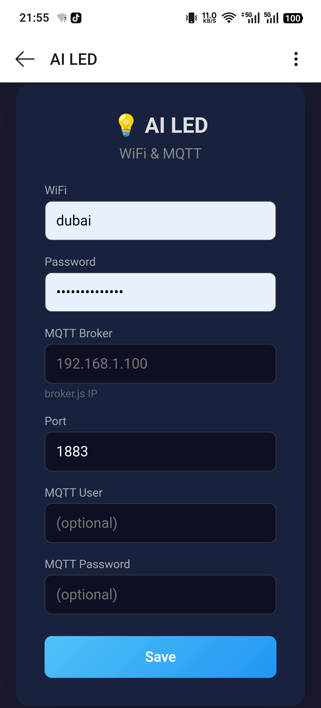

# AI LED Light

AI 编程助手实体指示灯 — 将 AI 编程助手的实时状态映射到桌面 LED 灯效，让你**一眼看到 AI 在干什么**。

支持 [OpenCode](https://opencode.ai) 插件，也兼容任何能发 MQTT 消息的 AI 编程工具。

## 功能特点

- **实时状态映射**：AI 思考时黄灯旋转、需要授权时红灯常亮、任务完成时绿灯、空闲时蓝灯呼吸、出错时红灯闪烁
- **一键安装**：`install.sh`（Linux/macOS）或 `install.bat`（Windows）安装依赖 + 部署插件，重启 OpenCode 即可使用
- **跨平台 SSL**：Web 烧录服务器自动生成自签名证书，Windows/Linux/macOS 均可使用 HTTPS
- **双模式 MQTT**：支持本地内嵌 Broker（局域网）和远程 Mosquitto Broker（公网）
- **多项目协调**：多个 OpenCode 项目同时运行时，自动取最高优先级状态
- **Web 烧录器**：Chrome/Edge 浏览器直接烧录 ESP32 固件，零安装
- **WiFi 配网**：ESP32 开启热点，手机浏览器一键配网，无需写死配置
- **支持多款芯片**：ESP32-C3（WS2812 RGB 灯带）和 ESP8266（PWM LED）

## 架构

### 本地模式（默认）

```
┌─── 你的电脑（开发机）──────────────────────┐
│                                            │
│  opencode + ai-led.js 插件                  │
│       │ 捕获事件                             │
│       ↓                                    │
│  MQTT publish → 内嵌 Broker (1883)         │
│                               │            │
└───────────────────────────────┼────────────┘
                                │ WiFi 局域网
                                ↓
                    ┌───────────────────────┐
                    │  ESP32 + WS2812 LED   │
                    │                       │
                    │  1. 连 WiFi           │
                    │  2. 连 MQTT Broker    │
                    │  3. 订阅 ai-led/state │
                    │  4. state → 灯效       │
                    └───────────────────────┘
```

### 远程模式

```
┌─── 你的电脑（开发机）──────────────────────┐
│                                            │
│  opencode + ai-led.js 插件                  │
│       │ 捕获事件                             │
│       ↓                                    │
│  MQTT publish → 远程 Broker (公网)         │
│                               │            │
└───────────────────────────────┼────────────┘
                                │ 互联网
                                ↓
                    ┌───────────────────────┐
                    │  远程 Mosquitto Broker │
                    │  (Docker, 端口 1883)   │
                    │  需要用户名密码认证      │
                    └───────────┬───────────┘
                                │ 互联网/WiFi
                                ↓
                    ┌───────────────────────┐
                    │  ESP32 + WS2812 LED   │
                    │  连接远程 Broker       │
                    └───────────────────────┘
```

## LED 状态映射

| 状态 | LED 效果 | 触发条件 |
|------|---------|---------|
| `thinking` | 黄色跑马灯旋转 | AI 思考/输出/执行工具 |
| `auth_required` | 红灯常亮 | 需要用户授权 |
| `done` | 绿灯常亮 | 任务完成 |
| `idle` | 蓝灯呼吸(2s) | 空闲待机 |
| `error` | 红灯慢闪(1.6s) | 出错 |
| `config` | 紫灯呼吸(800ms) | 配网模式 |






## 快速开始

### 0. 一句话提示词（给 AI 助手）

将以下提示词粘贴到你的 AI 编程助手（如 OpenCode）中，它会自动完成安装：

```
请克隆 https://github.com/mydubai7794/opencode-led 仓库，根据当前操作系统执行对应的安装脚本（Linux/macOS 用 bash install.sh，Windows 用 install.bat），安装完成后以本地模式启动插件。查看 README.md 了解详细用法。
```

### 1. 安装插件

**Linux / macOS：**
```bash
git clone https://github.com/mydubai7794/opencode-led.git
cd opencode-led
bash install.sh
opencode
```

**Windows：**
```cmd
git clone https://github.com/mydubai7794/opencode-led.git
cd opencode-led
install.bat
opencode
```

无需手动启动 broker，插件加载时自动管理 MQTT Broker 生命周期。

### 2. 配置 MQTT 模式

编辑 `mqtt-config.json`，默认使用本地模式：

```json
{
  "mode": "local",
  "local": {
    "host": "127.0.0.1",
    "port": 1883
  },
  "remote": {
    "host": "your-broker-ip",
    "port": 1883,
    "username": "",
    "password": ""
  }
}
```

| 字段 | 说明 |
|------|------|
| `mode` | `"local"` 或 `"remote"` |
| `local.host/port` | 本地内嵌 Broker 地址（local 模式使用） |
| `remote.host/port` | 远程 Mosquitto Broker 地址（remote 模式使用） |
| `remote.username/password` | 远程 Broker 认证凭据（remote 模式必填） |

- **local 模式**：插件自动启动内嵌 aedes Broker，ESP32 与电脑在同一局域网
- **remote 模式**：连接远程 Mosquitto Broker，ESP32 可通过互联网访问，跳过内嵌 Broker

### 3. 开发调试

**Linux / macOS：**
```bash
npm install              # 安装依赖
bash start.sh            # 启动独立 Broker + Subscriber
node test-publisher.js   # 发送测试消息
bash stop.sh             # 停止（安全，不影响 opencode）
```

**Windows：**
```cmd
npm install
start.bat
node test-publisher.js
stop.bat
```

## 硬件物料清单



### 方案一：ESP32-C3 + WS2812 RGB 灯带（推荐）

| 部件 | 型号 | 参考价 | 备注 |
|------|------|--------|------|
| MCU | ESP32-C3 Super Mini | ~¥8 | 合宙/乐鑫，USB-C 直插 |
| LED | WS2812B 灯带 (60颗/m) | ~¥5/米 | 只需截取 3 颗使用 |
| 按钮 | 轻触按键（可选） | ~¥0.1 | 重置配网（GPIO 9），也可不接 |
| USB-C 数据线 | | ~¥2 | 供电 + 烧录 |
| **合计** | | **~¥15** | |

接线：
```
ESP32-C3 Super Mini    WS2812B 灯带(3颗)
GPIO 8            →    DIN（数据输入）
5V                →    VCC（灯带供电）
GND               →    GND
GPIO 9            →    按钮 → GND（可选，重置配网）
```

> 灯带 3 颗串联共用一个数据线，固件中 `NUM_PIXELS=3`，所有 LED 同步显示相同颜色。

### 方案二：ESP8266 + PWM LED（三色灯）

| 部件 | 型号 | 参考价 | 备注 |
|------|------|--------|------|
| MCU | ESP8266 (NodeMCU / Wemos D1) | ~¥8 | |
| LED | 3x 单色 LED（红/绿/蓝） | ~¥0.3 | GPIO 14/12/13 各接一颗 |
| 电阻 | 3x 220Ω | ~¥0.1 | LED 限流电阻 |
| 按钮 | 轻触按键（可选） | ~¥0.1 | 重置配网（GPIO 0） |
| USB 数据线 | | ~¥2 | 供电 + 烧录 |
| **合计** | | **~¥10** | |

接线：
```
ESP8266           LED
GPIO 14 (D5)  →  220Ω → 红色 LED (+)  → GND
GPIO 12 (D6)  →  220Ω → 绿色 LED (+)  → GND
GPIO 13 (D7)  →  220Ω → 蓝色 LED (+)  → GND
GPIO 0  (D3)  →  按钮 → GND（可选，重置配网）
```

## ESP32 固件烧录

### 方式一：Web Flasher（推荐，零安装）



1. USB 线连接 ESP32 到电脑
2. 用 **Chrome/Edge** 打开 `flasher/index.html`（需本地 HTTP 服务）
3. 选择板子型号，点击"连接串口并烧录"

```bash
# 启动本地 HTTPS 服务（自动生成自签名证书，Windows/Linux/macOS 均可）
cd flasher
node server.mjs
# 浏览器打开 https://localhost:3000

# 或简单 HTTP 服务（仅本地，Web Serial API 限 localhost）
cd flasher
python3 -m http.server 8080
# 浏览器打开 http://localhost:8080
```

### 方式二：Arduino IDE

> PlatformIO CLI (`pip install platformio`) 仅用于**编译生成 .bin**，烧录请使用 Web Flasher 或 Arduino IDE。PlatformIO 的 `upload` 命令对 ESP32-C3 不可靠。

1. **安装 ESP32 支持**（一次性）：
   - Arduino IDE → 文件 → 首选项 → 附加开发板管理器 URL，添加：
     ```
     https://espressif.github.io/arduino-esp32/package_esp32_index.json
     ```
   - 工具 → 开发板 → 开发板管理器 → 搜索 `esp32` → 安装

2. **安装库**：
   - 工具 → 管理库 → 搜索安装：
     - `PubSubClient`（MQTT 客户端）
     - `Adafruit NeoPixel`（WS2812 驱动，ESP32-C3 方案）
     - `ArduinoJson`（JSON 解析）

3. **烧录**：
   - 打开对应固件：
     - ESP32-C3：`firmware/ai-led-firmware/ai-led-firmware.ino`
     - ESP8266：`firmware/ai-led-firmware-esp8266/ai-led-firmware-esp8266.ino`
   - 选择开发板和端口，点击上传

4. **导出 .bin**（用于 Web Flasher 分发）：
   - 项目 → 导出已编译的二进制文件
   - 将 .bin 放到 `flasher/firmware/` 对应目录

## WiFi 配网



```
首次启动 / 长按按钮重置
       │
       ↓
ESP32 开启 AP 热点 "AI-LED-xxxx"（紫灯呼吸）
       │
       ↓
手机连接该 WiFi → 自动弹出配网页面
       │
       ↓
填写：WiFi名称 + WiFi密码 + 电脑IP + 端口(1883)
       │
       ↓
保存 → 自动重启 → 连接 WiFi → 连接 MQTT → 开始工作
```

重置配网：**长按按钮** → 清除配置 → 重启进入配网模式。也可通过 Web Flasher 的"重置配网"按钮发送串口命令。

## 项目结构

```
opencode-led/
├── package.json              # Node.js 依赖
├── mqtt-config.json          # MQTT 连接配置（local/remote 模式）
├── opencode-plugin.js        # OpenCode 插件（支持本地/远程 MQTT）
├── install.sh                # 一键安装脚本（Linux/macOS）
├── install.bat               # 一键安装脚本（Windows）
├── broker.js                 # 独立 MQTT Broker（调试用）
├── subscriber.js             # 测试订阅者（调试用）
├── test-publisher.js         # 独立测试发布者
├── start.sh / stop.sh        # 服务管理脚本（Linux/macOS，调试用）
├── start.bat / stop.bat      # 服务管理脚本（Windows，调试用）
├── firmware/
│   ├── platformio.ini                       # PlatformIO 编译配置
│   ├── src/
│   │   ├── esp32/main.cpp                   # ESP32 编译入口（基于 ai-led-firmware）
│   │   └── esp8266/main.cpp                 # ESP8266 编译入口（基于 ai-led-firmware-esp8266）
│   ├── ai-led-firmware/
│   │   └── ai-led-firmware.ino              # ESP32-C3 固件源码（WS2812）
│   └── ai-led-firmware-esp8266/
│       └── ai-led-firmware-esp8266.ino      # ESP8266 固件源码（PWM LED）
├── flasher/
│   ├── index.html            # Web Flasher 页面
│   ├── server.mjs            # HTTPS 烧录服务器（自动生成 SSL 证书）
│   ├── build.sh              # ESP8266 固件编译脚本
│   └── firmware/
│       ├── esp32c3/          # ESP32-C3 预编译固件
│       └── esp8266/          # ESP8266 预编译固件
└── README.md
```

## MQTT 协议

- **Broker（local 模式）**: `mqtt://<电脑IP>:1883`（内嵌 aedes，无需认证）
- **Broker（remote 模式）**: `mqtt://<远程服务器IP>:1883`（Mosquitto，需用户名密码认证）
- **Topic**: `ai-led/state`（协调结果）、`ai-led/project`（per-project 原始状态）
- **QoS**: 1

```json
{"state":"thinking","ts":1779251086068,"seq":1,"detail":"message.part.delta"}
```

## 事件映射

| OpenCode 事件 | LED 状态 | 说明 |
|-------|-----|------|
| `permission.asked` | auth_required | 需要授权 |
| `permission.replied` | thinking | 授权后继续 |
| `question.asked` | auth_required | 弹出选择框 |
| `question.replied` | thinking | 选择后继续 |
| `message.part.delta` | thinking | AI 输出中（300ms 节流） |
| `session.diff` | thinking | 文件变更 |
| `session.status` | 心跳→done→idle | 状态轮询 |
| `session.idle` | done | 会话空闲 |
| `session.error` | error | 出错 |
| `tool.execute.before/after` | thinking | 执行工具 |

## 优先级机制

多项目同时运行时，自动取最高优先级状态：

`error(10) > auth_required(8) > thinking(5) > done(3) > idle(0)`

## 踩坑记录

1. **`lsof -ti:1883 | xargs kill` 会杀 opencode** — 改用 PID 文件管理
2. **`require("fs")` 在 ESM 插件中报错** — 必须用 `import fs from "fs"`
3. **`message.part.delta` 频率极高** — 每 token 一次，必须 300ms 节流
4. **ESP32 在 Arduino IDE 不需要额外 SDK** — 只需 Board Manager 添加 ESP32 URL
5. **插件内嵌 broker，无需手动 start.sh** — 自 v4 起 broker 随插件自动启停；端口冲突时自动降级为纯客户端模式
6. **remote 模式下跳过内嵌 Broker** — 插件自动读取 mqtt-config.json，远程模式直接连接外部 Mosquitto
7. **ESP32-C3 Web Serial RTS 复位不可靠** — 烧录/擦除后必须拔掉 USB 线重新插入（物理断电重启），Web Serial 的硬复位信号无法让固件正常启动，不拔插会表现为找不到 WiFi 热点
8. **ESP32-C3 USB-Serial/JTAG 不支持应用层串口命令** — 打开串口时 DTR 信号翻转会复位芯片，PING/RESET 等文本命令在 ROM bootloader 阶段丢失；重置配网改用 esptool 擦除 flash + 重烧固件的方式

## License

MIT
